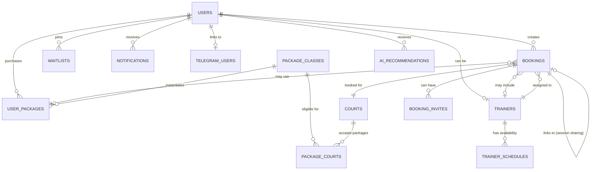

# Platform Architecture Schema
## Red Clay Tennis Booking Platform - Complete Technical Blueprint

**Generated:** January 14, 2026
**Version:** 2.0
**Purpose:** Unified technical schema for the complete platform architecture

---

## Executive Summary

This document provides a comprehensive technical schema for the Red Clay Tennis Booking Platform, consolidating all architectural decisions, data models, automation workflows, and implementation strategies into a single authoritative reference.

### Platform Overview

**Target Users:** 90% mobile, 10% desktop
**Architecture:** Serverless-first, edge-optimized
**Stack:** Neon PostgreSQL + Vercel
**Security:** JWT authentication at application layer (with optional RLS)
**Philosophy:** Automation-first, mobile-first, user-centric

### Documentation Structure

```
docs/
├── PLATFORM_ARCHITECTURE_SCHEMA.md          (This file - Complete technical blueprint)
├── IMPLEMENTATION_ROADMAP.md                (Phased implementation plan)
├── API_DOCUMENTATION.md                     (Complete API reference)
├── DEPLOYMENT_GUIDE.md                      (Production deployment procedures)
│
└── user-journey_refactored/
    ├── README.md                            (Overview & quick start)
    ├── PLATFORM.md                          (Stack & architecture directives)
    │
    ├── foundations/                         (Core technical systems)
    │   ├── database-schema.md               (14 tables + RLS policies)
    │   ├── authentication.md                (User types & role-based access)
    │   ├── automation-rules.md              (12 cross-linking automation workflows)
    │   └── mobile-first-ui.md               (Component library & design patterns)
    │
    └── features/                            (User-facing features)
        ├── 01-user-registration.md
        ├── 02-court-booking.md
        ├── 03-booking-management.md
        ├── 04-package-system.md
        ├── 05-waitlist.md
        ├── 06-session-sharing.md
        ├── 07-trainer-portal.md
        ├── 08-admin-dashboard.md
        ├── 09-notifications.md
        ├── 10-telegram-integration.md
        └── 11-ai-recommendations.md
```

---

## 1. System Architecture

### 1.1 High-Level Architecture

```
┌─────────────────────────────────────────────────────────────┐
│                     CLIENT LAYER                             │
│  ┌─────────────┐  ┌─────────────┐  ┌────────────────────┐  │
│  │   Mobile    │  │   Desktop   │  │   Telegram Bot     │  │
│  │   (PWA)     │  │   (Web)     │  │   (Bot API)        │  │
│  └──────┬──────┘  └──────┬──────┘  └─────────┬──────────┘  │
└─────────┼────────────────┼────────────────────┼─────────────┘
          │                │                    │
          ▼                ▼                    ▼
┌─────────────────────────────────────────────────────────────┐
│                    API / EDGE LAYER                          │
│  ┌───────────────────────────────────────────────────────┐  │
│  │        Vercel Edge Functions & Serverless APIs        │  │
│  │  • Authentication Middleware                          │  │
│  │  • Rate Limiting                                      │  │
│  │  • Request Validation                                 │  │
│  │  • Response Caching (Redis/KV)                        │  │
│  └────────────────────┬──────────────────────────────────┘  │
└──────────────────────┼─────────────────────────────────────┘
                       │
                       ▼
┌──────────────────────────────────────────────────────────────┐
│                    DATABASE LAYER                            │
│  ┌────────────────────────────────────────────────────────┐ │
│  │              Neon PostgreSQL (Serverless)              │ │
│  │  • 14 Core Tables                                      │ │
│  │  • Row Level Security (RLS) Policies                   │ │
│  │  • Automated Triggers & Functions                      │ │
│  │  • Connection Pooling                                  │ │
│  │  • Database Branching (per environment)                │ │
│  └────────────────────┬───────────────────────────────────┘ │
└──────────────────────┼──────────────────────────────────────┘
                       │
          ┌────────────┼────────────┐
          │            │            │
          ▼            ▼            ▼
┌──────────────┐ ┌──────────┐ ┌──────────────┐
│  Email       │ │  SMS     │ │  File        │
│  Provider    │ │  Provider│ │  Storage     │
│  (SendGrid)  │ │ (Twilio) │ │ (Vercel Blob)│
└──────────────┘ └──────────┘ └──────────────┘
```

### 1.2 Technology Stack

| Layer | Technology | Justification |
|-------|------------|---------------|
| **Database** | Neon PostgreSQL | Serverless Postgres with branching, auto-scaling, RLS |
| **Backend** | Vercel Serverless Functions | Edge network, auto-deployment, zero-config scaling |
| **Frontend** | React/Next.js | Mobile-first PWA, SSR/ISR capabilities |
| **Authentication** | JWT + Neon RLS | Stateless auth, database-level security |
| **Real-time** | WebSocket/SSE | Live booking updates, notification push |
| **Caching** | Vercel KV (Redis) | Edge caching for availability queries |
| **File Storage** | Vercel Blob | Profile images, document storage |
| **Email** | SendGrid/Resend | Transactional emails, notification delivery |
| **SMS** | Twilio | Urgent notifications (optional) |
| **Telegram** | Telegram Bot API | Bot-based bookings & notifications |
| **AI/ML** | OpenAI API | Recommendation engine, NLP for Telegram bot |

### 1.3 Architecture Principles

1. **Serverless-First**
   - No persistent backend servers
   - Stateless API routes/functions
   - Auto-scale with demand
   - Pay-per-execution model

2. **Edge-Optimized**
   - Static assets on CDN
   - API routes at edge locations
   - Database connection pooling
   - Sub-500ms API response times

3. **Security-First**
   - RLS enforces permissions at data layer
   - JWT tokens for API authentication
   - Input validation on all endpoints
   - Rate limiting to prevent abuse

4. **Mobile-First**
   - 90% of traffic from mobile devices
   - Touch-optimized UI (44px+ targets)
   - Progressive Web App (PWA)
   - Optimistic UI updates

5. **Automation-First**
   - Cross-linking between systems
   - Event-driven workflows
   - Scheduled background jobs
   - Real-time notification sync

---

## 2. Data Model & Database Schema

### 2.1 Core Entity Relationship Diagram



### 2.2 Table Summary

| Table | Rows (Est) | Purpose | Key Relationships |
|-------|------------|---------|-------------------|
| **users** | 1,000-10,000 | User profiles & metadata | Core entity for all user actions |
| **user_auth** | 1,000-10,000 | Password hashes & auth security | 1:1 with users |
| **courts** | 5-20 | Tennis/Pickleball facilities | Referenced by bookings |
| **bookings** | 5,000-50,000 | Court reservations | Links users, courts, trainers, packages |
| **trainers** | 5-15 | Professional trainers | Linked to users, schedules, bookings |
| **trainer_schedules** | 50-150 | Weekly recurring availability | Links trainers to time slots |
| **package_classes** | 10-30 | Available package offerings | Referenced by user_packages |
| **user_packages** | 500-5,000 | Individual purchases | Links users to package classes |
| **peak_day_overrides** | 20-50/year | Admin-designated peak days | Referenced by pricing logic |
| **package_courts** | 50-200 | Package-court eligibility | Links packages to courts |
| **booking_invites** | 1,000-10,000 | Session sharing invitations | Links bookings to invited users |
| **waitlists** | 200-2,000 | Slot-specific wait queues | Links users to desired slots |
| **notifications** | 10,000-100,000 | Multi-channel messages | Links to bookings, packages, waitlists |
| **ai_recommendations** | 1,000-10,000 | AI-generated suggestions | Links users to suggested actions |
| **telegram_users** | 100-1,000 | Telegram account links | Links platform users to Telegram |

**Total Tables:** 15 core tables
- 14 business logic tables
- 1 authentication security table (`user_auth`)

### 2.3 Critical Database Functions

#### Peak Time Detection
```sql
CREATE OR REPLACE FUNCTION is_peak_time(
    booking_date DATE,
    start_time TIME
) RETURNS BOOLEAN AS $$
BEGIN
    -- Admin overrides take precedence
    IF EXISTS (SELECT 1 FROM peak_day_overrides WHERE date = booking_date) THEN
        RETURN true;
    END IF;

    -- Weekends are always peak
    IF EXTRACT(DOW FROM booking_date) IN (0, 6) THEN
        RETURN true;
    END IF;

    -- Weekday off-peak: 6 AM - 5 PM
    IF EXTRACT(DOW FROM booking_date) BETWEEN 1 AND 5
       AND start_time >= '06:00:00'::TIME
       AND start_time < '17:00:00'::TIME THEN
        RETURN false;
    END IF;

    -- Default: peak (weekday evenings)
    RETURN true;
END;
$$ LANGUAGE plpgsql IMMUTABLE;
```

#### Trainer Availability Check
```sql
CREATE OR REPLACE FUNCTION is_trainer_available(
    p_trainer_id UUID,
    p_booking_date DATE,
    p_start_time TIME,
    p_end_time TIME
) RETURNS BOOLEAN AS $$
DECLARE
    v_day_of_week INTEGER;
BEGIN
    -- Check if trainer is active
    IF NOT EXISTS (
        SELECT 1 FROM trainers
        WHERE id = p_trainer_id AND is_active = true
    ) THEN
        RETURN false;
    END IF;

    -- Get day of week
    v_day_of_week := EXTRACT(DOW FROM p_booking_date);

    -- Check schedule availability
    IF NOT EXISTS (
        SELECT 1 FROM trainer_schedules
        WHERE trainer_id = p_trainer_id
          AND day_of_week = v_day_of_week
          AND is_available = true
          AND start_time <= p_start_time
          AND end_time >= p_end_time
    ) THEN
        RETURN false;
    END IF;

    -- Check for booking conflicts
    IF EXISTS (
        SELECT 1 FROM bookings
        WHERE trainer_id = p_trainer_id
          AND booking_date = p_booking_date
          AND start_time = p_start_time
          AND status IN ('confirmed', 'pending')
    ) THEN
        RETURN false;
    END IF;

    RETURN true;
END;
$$ LANGUAGE plpgsql STABLE;
```

### 2.4 Security Model

#### Current Implementation: Application-Layer Authentication

The platform uses **JWT authentication at the application layer** with the following approach:

**Authentication Flow:**
1. User credentials validated by API
2. JWT token issued with user_id, user_type, and app_role
3. Token sent in `Authorization: Bearer <token>` header
4. API middleware validates token and extracts user context
5. Database queries filtered by authenticated user_id

**Security Table:**
- `user_auth` table stores password hashes separately from user profiles
- Failed login tracking and account locking
- Password reset token management

#### Optional: Row Level Security (RLS) Policies

For enhanced defense-in-depth, RLS can be enabled at the database layer. The policies below are reference examples (currently commented out in implementation).

**Note:** Enabling RLS requires creating an `auth.uid()` function and configuring the database connection to set user context.

##### Users Table (Example - Not Active)
```sql
-- Users can view their own profile
CREATE POLICY users_select_own ON users
    FOR SELECT USING (auth.uid() = id);

-- Users can update their own profile
CREATE POLICY users_update_own ON users
    FOR UPDATE USING (auth.uid() = id);

-- Admins can view and modify all users
CREATE POLICY users_admin_all ON users
    FOR ALL USING (
        EXISTS (SELECT 1 FROM users WHERE id = auth.uid() AND app_role = 'admin')
    );
```

##### Bookings Table (Example - Not Active)
```sql
-- Users see own bookings
CREATE POLICY bookings_select_own ON bookings
    FOR SELECT USING (user_id = auth.uid());

-- Users see bookings they're invited to
CREATE POLICY bookings_select_invited ON bookings
    FOR SELECT USING (
        EXISTS (
            SELECT 1 FROM booking_invites
            WHERE booking_id = bookings.id
              AND invited_user_id = auth.uid()
              AND status = 'accepted'
        )
    );

-- Trainers see their assigned bookings
CREATE POLICY bookings_select_trainer ON bookings
    FOR SELECT USING (
        EXISTS (
            SELECT 1 FROM trainers
            WHERE trainers.user_id = auth.uid()
              AND trainers.id = bookings.trainer_id
        )
    );

-- Admins see all bookings
CREATE POLICY bookings_admin_all ON bookings
    FOR ALL USING (
        EXISTS (SELECT 1 FROM users WHERE id = auth.uid() AND app_role = 'admin')
    );
```

---

## 3. Authentication & Authorization

### 3.1 User Classification

#### User Types (Booking Behavior)

| Type | Default | Booking Flow | Purpose |
|------|---------|--------------|---------|
| **NEW** | Yes (all new signups) | Status: `pending` → Admin reviews → `confirmed` | Quality control, prevent spam |
| **PREMIUM** | No (admin upgrade) | Status: `confirmed` (instant) | Reward regulars, reduce admin load |

#### App Roles (System Access)

| Role | Permissions | Dashboard Access | API Scopes |
|------|-------------|------------------|------------|
| **user** | Book courts, purchase packages, join waitlist | User dashboard | Read own data, create own bookings |
| **trainer** | User permissions + trainer schedule | User + Trainer dashboard | Read assigned bookings, view schedule |
| **admin** | Full system access | All dashboards | Read/write all data, approve bookings |

### 3.2 Permission Matrix

| Action | NEW User | PREMIUM User | Trainer | Admin |
|--------|----------|--------------|---------|-------|
| Create booking (pending) | ✅ | ✅ | ✅ | ✅ |
| Create booking (confirmed) | ❌ | ✅ | ✅ | ✅ |
| Cancel own booking | ✅ | ✅ | ✅ | ✅ |
| Cancel any booking | ❌ | ❌ | ❌ | ✅ |
| View own bookings | ✅ | ✅ | ✅ | ✅ |
| View all bookings | ❌ | ❌ | ❌ | ✅ |
| Purchase package | ✅ | ✅ | ✅ | ✅ |
| Confirm package payment | ❌ | ❌ | ❌ | ✅ |
| Join waitlist | ✅ | ✅ | ✅ | ✅ |
| View trainer schedule | ❌ | ❌ | ✅ (own) | ✅ (all) |
| Modify trainer schedule | ❌ | ❌ | ❌ | ✅ |
| Upgrade user type | ❌ | ❌ | ❌ | ✅ |
| Manage courts | ❌ | ❌ | ❌ | ✅ |

### 3.3 JWT Token Structure

```json
{
  "sub": "user-uuid-here",
  "email": "user@example.com",
  "user_type": "premium",
  "app_role": "user",
  "iat": 1737590400,
  "exp": 1738195200
}
```

**Validation Flow:**
1. Client sends JWT in `Authorization: Bearer <token>` header
2. API function validates token signature
3. Extract `user_id`, `user_type`, `app_role`
4. Check permissions against permission matrix
5. Database RLS provides final enforcement layer

---

## 4. Core Automation Workflows

### 4.1 Booking Creation Automation

**Trigger:** User creates booking

**Workflow:**

```
1. VALIDATE INPUTS
   ├─ Check court availability (no conflicts)
   ├─ Check trainer availability (if requested)
   └─ Validate date/time (future dates only)

2. DETERMINE BOOKING STATUS
   ├─ If user_type = 'premium' OR app_role = 'admin'
   │  └─ status = 'confirmed'
   └─ If user_type = 'new'
      └─ status = 'pending'

3. PACKAGE DETECTION & APPLICATION
   ├─ Query active packages matching:
   │  ├─ user_id = booking.user_id
   │  ├─ sport_type = booking.court.sport_type
   │  ├─ remaining_sessions > 0
   │  ├─ NOT expired
   │  ├─ Session type matches (trainer vs court-only)
   │  ├─ Peak/off-peak compliance
   │  └─ Court eligibility (package_courts)
   │
   ├─ If package found:
   │  ├─ Set booking.package_id = package.id
   │  ├─ Set fees = $0
   │  ├─ Deduct session from package
   │  └─ If depleted: package.status = 'depleted'
   │
   └─ If no package:
      └─ Apply court + trainer hourly rates

4. WAITLIST PROCESSING
   └─ If status = 'confirmed':
      └─ Mark waitlist entries fulfilled for this slot

5. NOTIFICATIONS
   ├─ If status = 'confirmed':
   │  ├─ Notify user: "Booking confirmed"
   │  └─ Notify trainer: "New session assigned"
   │
   └─ If status = 'pending':
      ├─ Notify user: "Booking pending approval"
      └─ Notify all admins: "New booking requires approval"
```

### 4.2 Booking Cancellation Automation

**Trigger:** User or admin cancels booking

**Workflow:**

```
1. TIMING CHECK
   ├─ Calculate hours_until_booking
   │
   ├─ If >= 24 hours:
   │  └─ Auto-refund eligible
   │
   └─ If < 24 hours:
      ├─ Requires admin review
      └─ Set admin_review_required = true

2. PACKAGE REFUND (If Applicable)
   ├─ If hours_until >= 24:
   │  ├─ Return session to package
   │  ├─ If was depleted: reactivate package
   │  └─ Set package_refunded = true
   │
   └─ If hours_until < 24:
      └─ Flag for admin decision

3. WAITLIST NOTIFICATION
   ├─ Find all active waitlist entries for this slot
   ├─ Sort by created_at (first-come-first-served)
   ├─ Notify ALL waiting users via:
   │  ├─ In-app notification
   │  ├─ Email
   │  └─ Telegram (if linked)
   │
   └─ First to book wins, others see "unavailable"

4. UPDATE BOOKING STATUS
   ├─ Set status = 'cancelled'
   ├─ Set cancelled_at = now()
   └─ Record cancellation_reason

5. NOTIFICATIONS
   ├─ Notify booking owner: "Booking cancelled" + refund status
   └─ If trainer assigned: "Session cancelled"
```

### 4.3 Package Purchase & Confirmation

**Purchase Flow:**
```
1. USER REQUESTS PACKAGE
   ├─ Create user_package record
   │  ├─ status = 'requested'
   │  ├─ Copy session counts from package_class
   │  ├─ Calculate expires_at = now() + validity_days
   │  └─ Set payment_received = false
   │
   ├─ Notify user: "Package requested - pay at facility"
   └─ Notify admins: "New package request"

2. ADMIN CONFIRMS PAYMENT
   ├─ Update package:
   │  ├─ status = 'active'
   │  ├─ payment_received = true
   │  ├─ confirmed_at = now()
   │  └─ confirmed_by = admin_id
   │
   ├─ Retroactive booking updates:
   │  └─ Apply package to pending bookings if eligible
   │
   └─ Notify user: "Package activated!"
```

### 4.4 Scheduled Automation Jobs

| Frequency | Job | Actions |
|-----------|-----|---------|
| **Daily (6 AM)** | Package expiration | • Mark expired packages<br>• Send 7-day expiration warnings<br>• Clean old notifications |
| **Daily (6 AM)** | Waitlist cleanup | • Expire past-date waitlists<br>• Clean fulfilled entries |
| **Daily (6 AM)** | AI recommendations | • Generate personalized suggestions<br>• Analyze booking patterns |
| **Hourly** | Booking reminders | • Send 2-hour-before reminders<br>• Check for no-shows (10min after) |
| **Real-time** | Event-driven | • Booking created/cancelled<br>• Package confirmed<br>• Notification created |

---

## 5. API Architecture

### 5.1 API Endpoint Structure

```
Authentication Endpoints
POST   /api/auth/signup              Create new user account
POST   /api/auth/login               Authenticate user, return JWT
POST   /api/auth/logout              Invalidate refresh token
GET    /api/auth/me                  Get current user profile
PATCH  /api/auth/me                  Update current user profile

Booking Endpoints
GET    /api/bookings                 List user's bookings (with filters)
POST   /api/bookings                 Create new booking
GET    /api/bookings/:id             Get booking details
PATCH  /api/bookings/:id             Update booking
DELETE /api/bookings/:id             Cancel booking
POST   /api/bookings/:id/invites     Invite friend to session
PATCH  /api/bookings/invites/:id     Accept/decline invite

Court Endpoints
GET    /api/courts                   List all courts
GET    /api/courts/:id               Get court details
GET    /api/courts/:id/availability  Check availability for date range

Package Endpoints
GET    /api/packages                 List available package classes
POST   /api/packages/request         Request new package
GET    /api/packages/my-packages     List user's packages
GET    /api/packages/:id             Get package details
GET    /api/packages/:id/history     Get usage history

Waitlist Endpoints
POST   /api/waitlist                 Join waitlist for slot
GET    /api/waitlist/my-entries      List user's waitlist entries
DELETE /api/waitlist/:id             Leave waitlist

Notification Endpoints
GET    /api/notifications            List notifications (paginated)
PATCH  /api/notifications/:id/read   Mark as read
DELETE /api/notifications/:id        Delete notification

Admin Endpoints
GET    /api/admin/bookings/pending   List pending approvals
PATCH  /api/admin/bookings/:id/approve   Approve booking
PATCH  /api/admin/bookings/:id/deny      Deny booking
POST   /api/admin/packages/confirm   Confirm package payment
PATCH  /api/admin/users/:id/upgrade  Upgrade user type

Trainer Endpoints
GET    /api/trainer/dashboard        Trainer's dashboard data
GET    /api/trainer/schedule         Weekly schedule view
GET    /api/trainer/bookings         Assigned bookings
```

### 5.2 Standard API Response Format

**Success Response:**
```json
{
  "success": true,
  "data": {
    "booking": {
      "id": "uuid",
      "user_id": "uuid",
      "court_name": "Court 1",
      "booking_date": "2026-01-20",
      "start_time": "10:00:00",
      "end_time": "11:00:00",
      "status": "confirmed",
      "total_fee": 50.00,
      "package_used": true
    }
  },
  "meta": {
    "timestamp": "2026-01-14T10:00:00Z",
    "request_id": "req_123"
  }
}
```

**Error Response:**
```json
{
  "success": false,
  "error": {
    "code": "COURT_UNAVAILABLE",
    "message": "Court is already booked at this time",
    "details": {
      "court_id": "uuid",
      "conflicting_booking_id": "uuid",
      "suggested_times": ["11:00:00", "12:00:00"]
    }
  },
  "meta": {
    "timestamp": "2026-01-14T10:00:00Z",
    "request_id": "req_123"
  }
}
```

### 5.3 Error Code Taxonomy

| Category | Code | HTTP Status | Meaning |
|----------|------|-------------|---------|
| **Auth** | `UNAUTHORIZED` | 401 | Invalid or missing token |
| **Auth** | `FORBIDDEN` | 403 | Valid token, insufficient permissions |
| **Auth** | `TOKEN_EXPIRED` | 401 | JWT token expired |
| **Validation** | `VALIDATION_ERROR` | 400 | Input validation failed |
| **Validation** | `MISSING_FIELDS` | 400 | Required fields missing |
| **Booking** | `COURT_UNAVAILABLE` | 409 | Court already booked |
| **Booking** | `TRAINER_UNAVAILABLE` | 409 | Trainer already booked |
| **Booking** | `PAST_DATE` | 400 | Cannot book past dates |
| **Booking** | `BOOKING_NOT_FOUND` | 404 | Booking doesn't exist |
| **Package** | `PACKAGE_DEPLETED` | 400 | No sessions remaining |
| **Package** | `PACKAGE_EXPIRED` | 400 | Package past expiration |
| **Package** | `PACKAGE_INELIGIBLE` | 400 | Package doesn't apply to booking |
| **System** | `INTERNAL_ERROR` | 500 | Unexpected server error |
| **System** | `DATABASE_ERROR` | 503 | Database connection issue |
| **Rate Limit** | `RATE_LIMIT_EXCEEDED` | 429 | Too many requests |

---

## 6. Frontend Architecture

### 6.1 Component Hierarchy

```
App
├── Layout
│   ├── TopBar (56px fixed)
│   │   ├── MenuButton
│   │   ├── Logo
│   │   └── ActionButtons (Notifications, Profile)
│   │
│   ├── ContentArea (scrollable)
│   │   └── [Page Content]
│   │
│   └── BottomNav (56px fixed)
│       ├── HomeTab
│       ├── BookTab
│       ├── PackagesTab
│       └── ProfileTab
│
├── Pages
│   ├── Dashboard
│   │   ├── WelcomeCard
│   │   ├── UpcomingBookings
│   │   │   └── BookingCard[]
│   │   ├── ActivePackages
│   │   │   └── PackageCard[]
│   │   └── AIRecommendations
│   │       └── RecommendationCard[]
│   │
│   ├── BookingFlow
│   │   ├── SportSelection
│   │   ├── DateTimePicker
│   │   ├── TrainerSelection
│   │   │   └── TrainerCard[]
│   │   ├── CourtSelection
│   │   │   └── CourtCard[]
│   │   └── ReviewConfirm
│   │
│   ├── PackagesPage
│   │   ├── AvailablePackages
│   │   │   └── PackageClassCard[]
│   │   └── MyPackages
│   │       └── UserPackageCard[]
│   │
│   ├── TrainerPortal (trainer role)
│   │   ├── TodaysSessions
│   │   ├── WeeklySchedule
│   │   └── BookingHistory
│   │
│   └── AdminDashboard (admin role)
│       ├── PendingApprovals
│       ├── PackageConfirmations
│       ├── UserManagement
│       └── Analytics
│
└── Shared Components
    ├── Button (Primary, Secondary, Tertiary)
    ├── Input (Text, Email, Tel, Password)
    ├── Card
    ├── StatusBadge
    ├── BottomSheet
    ├── Toast/Snackbar
    └── LoadingSpinner
```

### 6.2 Mobile-First Design Specifications

| Element | Mobile Spec | Tablet Spec | Desktop Spec |
|---------|-------------|-------------|--------------|
| **Touch Targets** | 44x44px min | 48x48px | 40x40px |
| **Body Text** | 16px | 16px | 16px |
| **Headings** | 24-28px | 28-32px | 32-36px |
| **Buttons** | 48px height | 44px height | 40px height |
| **Input Fields** | 56px height | 52px height | 48px height |
| **Card Padding** | 16px | 20px | 24px |
| **Screen Padding** | 16px | 24px | 32px |
| **Bottom Nav** | 56px + safe area | Hidden (side nav) | Hidden (side nav) |

### 6.3 State Management

**State Categories:**
- **Server State:** Managed via React Query / SWR
  - Bookings, packages, notifications
  - Automatic caching, refetching, optimistic updates

- **UI State:** Managed via Context API or Zustand
  - Modal open/closed
  - Selected filters
  - Current tab

- **Auth State:** Managed via Auth Context
  - Current user
  - JWT token
  - User permissions

**Caching Strategy:**
```typescript
// Example: React Query configuration
const queryClient = new QueryClient({
  defaultOptions: {
    queries: {
      staleTime: 5 * 60 * 1000, // 5 minutes
      cacheTime: 10 * 60 * 1000, // 10 minutes
      refetchOnWindowFocus: true,
      retry: 1
    }
  }
});

// Specific cache times per data type
useQuery('courts', fetchCourts, { staleTime: 60 * 60 * 1000 }); // 1 hour (rarely changes)
useQuery('availability', fetchAvailability, { staleTime: 2 * 60 * 1000 }); // 2 minutes
useQuery('bookings', fetchBookings, { staleTime: 5 * 60 * 1000 }); // 5 minutes
```

---

## 7. Performance & Optimization

### 7.1 Performance Targets

| Metric | Target | Rationale |
|--------|--------|-----------|
| **First Contentful Paint (FCP)** | < 1.5s | Fast perceived load |
| **Largest Contentful Paint (LCP)** | < 2.5s | Core Web Vitals |
| **Time to Interactive (TTI)** | < 3.0s | Usable quickly |
| **First Input Delay (FID)** | < 100ms | Responsive to interaction |
| **Cumulative Layout Shift (CLS)** | < 0.1 | Stable layout |
| **API Response Time** | < 500ms (p95) | Snappy interactions |
| **Database Query Time** | < 100ms (p95) | Fast data access |

### 7.2 Optimization Strategies

**Frontend:**
- Code splitting by route
- Lazy load below-fold components
- Image optimization (WebP, responsive)
- Service worker for offline capability
- Prefetch critical resources

**API:**
- Edge caching for static data (courts, package classes)
- Connection pooling for database
- Batch similar queries
- Compression (gzip/brotli)
- Rate limiting per user

**Database:**
- Indexes on all foreign keys and frequently queried columns
- Composite indexes for common query patterns
- Database branching per environment
- Read replicas for analytics (future)

### 7.3 Monitoring & Observability

**Application Metrics:**
```typescript
// Track key business metrics
metrics.counter('booking.created', { user_type, status });
metrics.histogram('booking.creation_duration_ms', duration);
metrics.gauge('bookings.pending.count', pendingCount);
metrics.gauge('packages.active.count', activeCount);
```

**Error Tracking:**
- Sentry for exception monitoring
- Log levels: DEBUG, INFO, WARN, ERROR
- Structured logging (JSON format)
- User context attached to errors

**Alerts:**
- Failed deployment
- Error rate > 1%
- API latency > 1s (p95)
- Database connection pool exhausted
- Disk space < 10%

---

## 8. Security

### 8.1 Security Layers

```
┌─────────────────────────────────────────┐
│  1. CLIENT LAYER                        │
│     • Input validation                  │
│     • XSS prevention                    │
│     • Secure token storage              │
└──────────────────┬──────────────────────┘
                   │
┌──────────────────▼──────────────────────┐
│  2. API LAYER                           │
│     • JWT validation                    │
│     • Rate limiting                     │
│     • Input sanitization                │
│     • Role-based access control         │
└──────────────────┬──────────────────────┘
                   │
┌──────────────────▼──────────────────────┐
│  3. DATABASE LAYER                      │
│     • Row Level Security (RLS)          │
│     • SQL injection prevention          │
│     • Encrypted connections (SSL/TLS)   │
│     • Audit logging                     │
└─────────────────────────────────────────┘
```

### 8.2 Security Checklist

**Authentication:**
- [x] JWT tokens with expiration (7 days)
- [x] Refresh tokens (30 days)
- [x] Password hashing (bcrypt, cost 12+)
- [x] Password requirements enforced
- [x] Rate limit login attempts (5 per 15 min)

**Authorization:**
- [x] RLS policies on all user-facing tables
- [x] Permission checks before all operations
- [x] Role-based access control (user, trainer, admin)
- [x] Audit logs for admin actions

**Data Protection:**
- [x] HTTPS only (no mixed content)
- [x] Encrypted database connections
- [x] Secure token storage (httpOnly cookies)
- [x] Input validation on all endpoints
- [x] Output encoding to prevent XSS

**API Security:**
- [x] Rate limiting (100 req/min per user)
- [x] CORS policy configured
- [x] Content Security Policy (CSP) headers
- [x] SQL injection prevention (parameterized queries)
- [x] Error messages don't leak sensitive data

### 8.3 Compliance

**GDPR Considerations:**
- User data export functionality
- Account deletion with data purge
- Cookie consent banner
- Privacy policy
- Data retention policy (bookings: 2 years, logs: 90 days)

**PCI DSS (Future - if processing payments):**
- NO card data stored in database
- Use payment processor (Stripe/Square)
- Tokenized payment methods only

---

## 9. Deployment & DevOps

### 9.1 Environment Strategy

| Environment | Purpose | Database | Deployment |
|-------------|---------|----------|------------|
| **Development** | Local development | Neon branch (per developer) | Manual (local) |
| **Preview** | PR testing | Neon branch (per PR) | Auto (on PR creation) |
| **Staging** | Pre-production testing | Neon branch (staging) | Auto (on merge to staging) |
| **Production** | Live users | Neon main branch | Auto (on merge to main) |

### 9.2 CI/CD Pipeline

```
┌─────────────┐
│  Git Push   │
└──────┬──────┘
       │
       ▼
┌─────────────────────────────────┐
│  GitHub Actions                 │
│  1. Run linting (ESLint)        │
│  2. Run type checking (TSC)     │
│  3. Run unit tests (Jest)       │
│  4. Run integration tests       │
│  5. Build application           │
└──────────────┬──────────────────┘
               │
               ▼
        ┌──────────────┐
        │  Tests Pass? │
        └───┬──────────┘
            │ Yes
            ▼
┌─────────────────────────────────┐
│  Vercel Deployment              │
│  1. Deploy to edge network      │
│  2. Run database migrations     │
│  3. Warm cache                  │
│  4. Run smoke tests             │
└──────────────┬──────────────────┘
               │
               ▼
        ┌──────────────┐
        │ Deploy Success│
        └──────┬────────┘
               │
               ▼
        [Notify Team]
```

### 9.3 Database Migrations

**Migration Strategy:**
- Sequential numbered migrations (001, 002, etc.)
- Idempotent (can run multiple times safely)
- Rollback script for each migration
- Run migrations before code deployment

**Example Migration:**
```sql
-- Migration: 005_add_session_sharing.sql

BEGIN;

-- Add session sharing fields to bookings
ALTER TABLE bookings
  ADD COLUMN is_primary_booking BOOLEAN DEFAULT true,
  ADD COLUMN primary_booking_id UUID REFERENCES bookings(id);

-- Create booking_invites table
CREATE TABLE booking_invites (
  id UUID PRIMARY KEY DEFAULT gen_random_uuid(),
  booking_id UUID NOT NULL REFERENCES bookings(id) ON DELETE CASCADE,
  invited_by UUID NOT NULL REFERENCES users(id),
  invited_user_id UUID REFERENCES users(id),
  invited_email VARCHAR(255),
  status VARCHAR(20) NOT NULL DEFAULT 'pending',
  created_at TIMESTAMP DEFAULT CURRENT_TIMESTAMP,
  CHECK (invited_user_id IS NOT NULL OR invited_email IS NOT NULL)
);

-- Add indexes
CREATE INDEX idx_booking_invites_booking_id ON booking_invites(booking_id);
CREATE INDEX idx_bookings_primary_booking_id ON bookings(primary_booking_id);

-- Update version tracking
INSERT INTO schema_migrations (version, applied_at)
VALUES (5, CURRENT_TIMESTAMP);

COMMIT;
```

### 9.4 Rollback Procedure

**If deployment fails:**
1. Revert to previous Vercel deployment (instant)
2. Check database migration status
3. If migration applied: Run rollback migration
4. Verify system health
5. Investigate root cause
6. Create fix, test in preview environment
7. Re-deploy

**Database Rollback:**
```sql
-- Rollback: 005_add_session_sharing.sql

BEGIN;

DROP TABLE booking_invites;

ALTER TABLE bookings
  DROP COLUMN is_primary_booking,
  DROP COLUMN primary_booking_id;

DELETE FROM schema_migrations WHERE version = 5;

COMMIT;
```

---

## 10. Testing Strategy

### 10.1 Testing Pyramid

```
        ┌──────────┐
       ┌┴──────────┴┐
       │  E2E Tests  │  (10% - Critical user flows)
       └────────────┘
     ┌────────────────┐
    ┌┴────────────────┴┐
    │ Integration Tests │  (30% - API endpoints)
    └──────────────────┘
  ┌──────────────────────┐
 ┌┴──────────────────────┴┐
 │      Unit Tests         │  (60% - Business logic)
 └────────────────────────┘
```

### 10.2 Test Coverage Requirements

| Layer | Target Coverage | Tools |
|-------|-----------------|-------|
| **Unit Tests** | 80%+ | Jest, React Testing Library |
| **Integration Tests** | 70%+ | Supertest, Neon Test DB |
| **E2E Tests** | Critical paths only | Playwright, Cypress |

### 10.3 Key Test Scenarios

**Unit Tests:**
- Package application algorithm
- Peak time detection
- Trainer availability logic
- Permission checks
- Input validation

**Integration Tests:**
- POST /api/bookings (with/without package)
- DELETE /api/bookings/:id (refund logic)
- PATCH /api/admin/bookings/:id/approve
- POST /api/packages/request
- GET /api/bookings (RLS policies)

**E2E Tests:**
- Complete booking flow (NEW user)
- Complete booking flow (PREMIUM user)
- Package purchase and usage
- Waitlist join and notification
- Admin approval workflow

### 10.4 Test Data Management

**Test Database:**
- Neon branch dedicated for testing
- Seed data script creates:
  - 5 test users (NEW, PREMIUM, trainer, admin)
  - 3 test courts
  - 2 test trainers
  - 3 test package classes
  - Sample bookings and packages

**Seed Script:**
```sql
-- seeds/test_data.sql

-- Admin user
INSERT INTO users (id, email, full_name, user_type, app_role)
VALUES (
  '00000000-0000-0000-0000-000000000001',
  'admin@test.com',
  'Test Admin',
  'premium',
  'admin'
);

-- Premium user
INSERT INTO users (id, email, full_name, user_type, app_role)
VALUES (
  '00000000-0000-0000-0000-000000000002',
  'premium@test.com',
  'Premium User',
  'premium',
  'user'
);

-- NEW user
INSERT INTO users (id, email, full_name, user_type, app_role)
VALUES (
  '00000000-0000-0000-0000-000000000003',
  'new@test.com',
  'New User',
  'new',
  'user'
);

-- Courts
INSERT INTO courts (id, name, sport_type, hourly_rate, is_active)
VALUES
  ('00000000-0000-0000-0000-000000000010', 'Test Court 1', 'tennis', 50.00, true),
  ('00000000-0000-0000-0000-000000000011', 'Test Court 2', 'tennis', 50.00, true),
  ('00000000-0000-0000-0000-000000000012', 'Test Pickleball Court', 'pickleball', 40.00, true);

-- ... more seed data ...
```

---

## 11. Future Enhancements

### 11.1 Phase 4: Payments & Revenue (Weeks 10-12)

**Goals:**
- Online payment processing
- Package auto-renewal
- Dynamic pricing

**Implementation:**
- Integrate Stripe/Square
- Add `payments` table
- Subscription management
- Invoice generation

### 11.2 Phase 5: Advanced Features (Weeks 13-15)

**Goals:**
- Reviews & ratings
- Loyalty program
- Tournament management

**Implementation:**
- Add `reviews` table
- Points system
- Tournament bracket generator
- Leaderboards

### 11.3 Technical Debt & Optimizations

**Performance:**
- Database query optimization audit
- Frontend bundle size reduction
- Implement CDN for static assets
- Add Redis for session storage

**Scalability:**
- Database read replicas
- Horizontal scaling for API functions
- Message queue for async jobs (BullMQ)
- Implement event sourcing for audit trail

**Developer Experience:**
- End-to-end test suite expansion
- Storybook for component library
- API documentation automation (OpenAPI/Swagger)
- Local development environment Docker setup

---

## 12. Conclusion

This Platform Architecture Schema provides a complete technical blueprint for the Red Clay Tennis Booking Platform. It consolidates:

- ✅ System architecture & technology stack
- ✅ Complete data model with 15 tables (including security table)
- ✅ JWT authentication with application-layer security model
- ✅ 12 core automation workflows
- ✅ RESTful API structure
- ✅ Frontend component architecture
- ✅ Performance targets & optimization strategies
- ✅ Security layers & compliance
- ✅ Deployment & DevOps procedures
- ✅ Testing strategy & coverage
- ✅ Future enhancement roadmap

### Next Steps

1. **Review & Approve:** Stakeholders review this architecture
2. **Implementation Roadmap:** Create detailed phased implementation plan
3. **API Documentation:** Generate complete API reference (OpenAPI spec)
4. **Development Environment:** Set up Neon + Vercel environments
5. **Begin Phase 1:** Start MVP implementation (Weeks 1-3)

### Related Documentation

- **Implementation Roadmap:** `docs/IMPLEMENTATION_ROADMAP.md` (detailed phased plan)
- **API Reference:** `docs/API_DOCUMENTATION.md` (complete endpoint specs)
- **Deployment Guide:** `docs/DEPLOYMENT_GUIDE.md` (production procedures)
- **Feature Specs:** `docs/user-journey_refactored/features/` (11 feature documents)
- **Foundation Docs:** `docs/user-journey_refactored/foundations/` (4 technical guides)

---

**Document Version:** 2.0
**Last Updated:** January 14, 2026
**Status:** Complete - Ready for Implementation
**Maintainer:** Development Team
